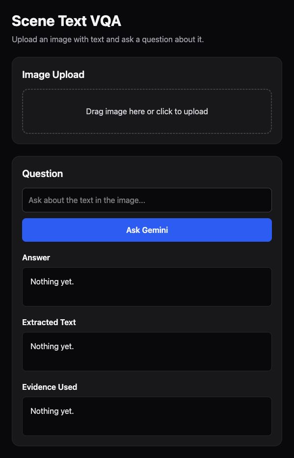

# Scene Text VQA

A focused visual question-answering app that reads text in an uploaded image, answers a natural-language question, and shows the evidence behind its answer.



## Highlights

- Drag-and-drop image upload with an instant preview
- Suggested questions for quick exploration
- Text extraction and grounded visual question answering
- Evidence spans that make each answer easier to verify
- Responsive dark interface built with React and Tailwind CSS

## Tech stack

- React 19
- Vite 8
- Tailwind CSS 4
- Google Gemini API

## Run locally

```bash
git clone REPOSITORY_URL
cd scene-text-vqa
npm install
cp .env.example .env
npm run dev
```

Add your Gemini API key to `.env`:

```env
VITE_GEMINI_API_KEY=your_api_key_here
```

Create a key in [Google AI Studio](https://aistudio.google.com/app/apikey).

## Available commands

```bash
npm run dev       # Start the development server
npm run build     # Create a production build
npm run lint      # Run ESLint
npm run preview   # Preview the production build
```

## Security note

This is a client-side demo. Vite exposes variables prefixed with `VITE_` to the browser, so use a restricted development key. For production, proxy Gemini requests through a backend and keep the API key server-side.

## How it works

1. The browser converts the uploaded image to base64.
2. Gemini extracts readable text and answers the user's question.
3. A second grounded prompt identifies the exact text spans used as evidence.

## License

This project is available under the MIT License.
